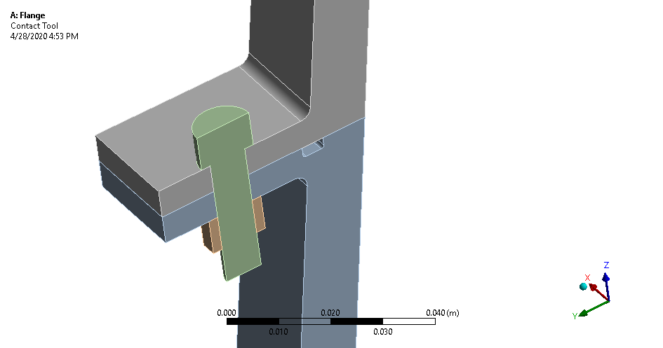
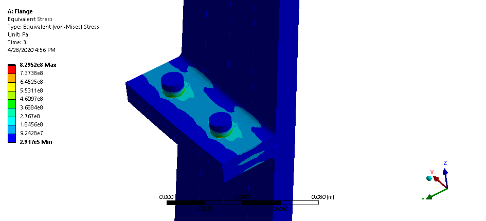
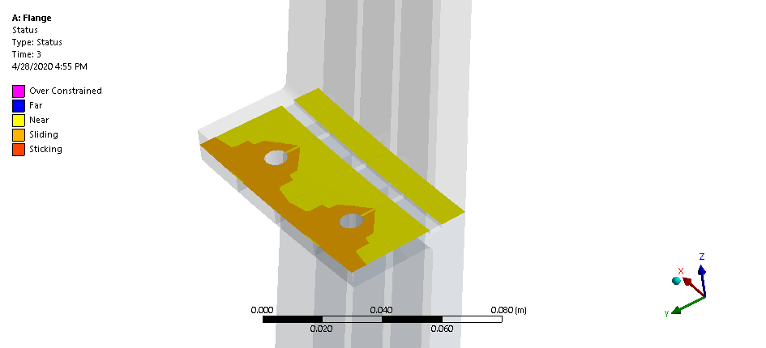

# Bolted Flange Analysis
The following represents a combined structural and thermal analysis of a bolted flange setup over a 3 second window. The assembly consists of a two steel rocket pieces held together by fasteners. 
The bolt and nut are stainless steel, and said bolt is preloaded to 10,320 N. While initially at an ambient 21 C (70 F), temperature quickly rises partially simulating a rocket launch.
Evidently, after two seconds, the two flanges experience a sudden verticle reactant force of over 4000 N. And at three seconds, the entire system is subject to temperatures over 370 C (699 F) 

The modes of the aluminum wing are:
| Time (s) | Temperature (C) | Force (N) |
| ---      | ---       | ---       |
| 0 | 21 | - |
| 1 | 21 | - |
| 2 | 21 | 4448.2 |
| 3 | 371 | 4448.2 |

### Equivalent Stress (Von-mises)

### Gap between all parts after three second simulation

## Built With

* [WorkBench 2020 R1](https://www.ansys.com/products/platform) - CAE simulation framework used
* [Ansys Mechanical APDL Solver](https://www.ansys.com/services/training-center/structures/introduction-to-ansys-mechanical-apdl) - Mechanical Physics Solver
* [Ansys Static Structural](https://www.ansys.com/products/structures) - FEA module
